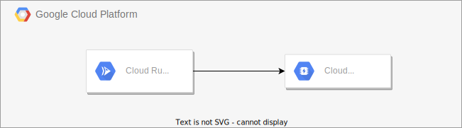

# eckero-admin-api

Eckerö Line Admin API

This project consists of a RESTful API that can be used to clear the Redis cache from Google Cloud Console.

Runs on Google Cloud's fully managed compute platform [Google Cloud Run](https://cloud.google.com/run).

## Documentation

The RESTful API is documented using the OAS 3.0 specification and can be found in this repository under `./docs/eckero-admin-api.swagger.json`.

[Swagger UI](https://swagger.io/tools/swagger-ui/) can be used to visualize the specification in a web environment.

## Architecture

## Development

The project can be developed on any environment supporting [Docker](https://www.docker.com/), [NodeJS](https://nodejs.org/) and the [Google Cloud SDK](https://cloud.google.com/sdk/gcloud).

### Prerequisites

- NodeJs v18 (latest Maintenance LTS)
- Yarn `npm -g install yarn`
- [Google Cloud SDK](https://cloud.google.com/sdk/gcloud)
- [Docker Desktop](https://www.docker.com/products/docker-desktop)

### Install

- `yarn` to install project dependencies
- `cp .env.test .env` and replace environment variables

### Run

- `yarn dev` to start the development server
- api available at [http://localhost:8080](http://localhost:8080)

## Environments & Infrastructure

All environments run on Google Cloud and are provisioned and configured using [Terraform](https://www.terraform.io/).
Additional information about the infrastructure can be found in the [README](terraform/README.md).

Eckerö Admin API is a private API and can only be accessed via Google Cloud Console.

## Deployment

Deployment of the API to [Google Cloud Run](https://cloud.google.com/run) is fully automated using [Google Cloud Build](https://cloud.google.com/cloud-build). The Cloud Build configuration file can be found in this repository under `./cloudbuild.yaml`.

Github branches `develop` and `master` are configured to be automatically built and deployed on every push to the repository:

- `develop` is deployed to the `staging` environment
- `master` is deployed to the `production` environment

The Cloud Build triggers are configured using [Terraform](https://www.terraform.io/) under `./terrafom/` in in this repository
